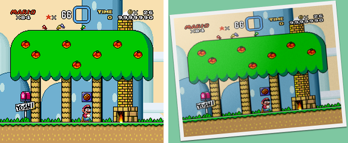
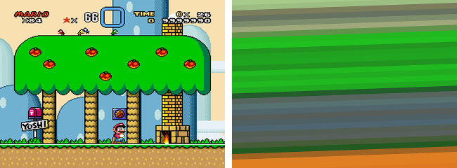
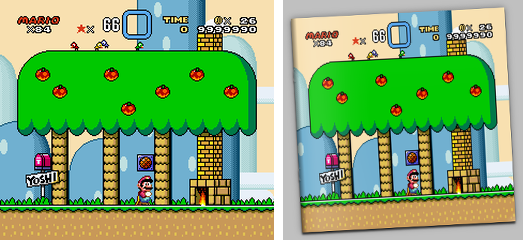
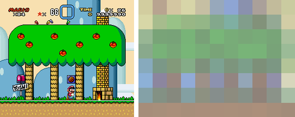
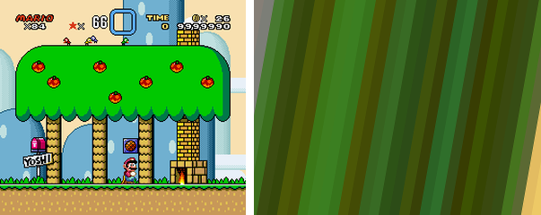

*hq_img_convert* Command Line Usage
===================================

1. Mandatory Parameters
-----------------------

{mode} src dst

* `{mode}`, it's the name of the modification to be applied to the source image (or directory). The available modes at
  this moment are `frame`, `hbars`, `magcover`, `mosaic`, `vbars`. You can see a description of them below in Section 3.

* `src`, it's the source image or directory of images to be modified. i.e. `/home/john/pictures/my_cat.jpg` if you
  want to modify a single picture or `/home/john/pictures` if you want to modify all the pictures contained in one
  directory.
  
* `dst`, it's the destination image or directory to put the images in. i.e. `/home/john/modified_imgs/cat.gif`
  or `/home/john/modified_imgs`.

For example:

    hq_img_convert.py vbars /home/john/pictures/my_cat.jpg /tmp/modified_picture_of_my_cat.gif

2. Optional Parameters
----------------------

* `-a [width],[height]`, aspect ratio. Controls the width/height proportions of the image. i.e. `-a 16,9` for typical
  TV panoramic images.

* `-c [RGBA hex color]`, color. Used for different things depending on the mode. i.e. `-c ff0000` is solid red and
  `-c ff000080` is 50% transparent red.

* `-e [extension]`, extension. Extension of the output file. i.e. `-e jpg` to produce a jpg image. By default, the
  output images will have the same extension than the source images. When you are working with a single image, you can
  directly specify the extension of the final image by its name. i.e. `hq_img_convert source.jpg destination.gif`. But,
  when you work with directories, you can use `-e` option to choose the format. i.e
  `hq_img_convert -e gif src_dir dst_dir`.

* `-o [A,B]`, two options where A and B are float numbers. They mean different things for each mode. i.e. in `hbars`
  mode you can select the number of bars and the number of colors like `-o [colors],[bars]`.

* `-r`, clockwise rotation angle in degrees. i.e. `-r 15.2`.

* `-s`, size in pixels. i.e. `-s 640,480`. Notice that for some effects this is the FINAL size of the output image while
  for others it can be slightly different. i.e. in `frame` mode, the image is resized to the values indicated by this
  options; then, an extra frame is added around the image and it's rotated. Both modifications increase the final size.

3. Modes
--------

### 1. *frame* - Picture frame

  
*mosaic - Original and converted image*

  * `-c` controls the background color.
  
  * `-o` controls the location of the soft bright point into the image. 0.0,0.0 is the top-left corner and 1.0,1.0 is
    the bottom-right corner.
     
  * `-s` controls the size of the picture itself. Notice the frame, the shadow, and the rotation will increase the final
    size of the image.

Example:

    hq_img_convert.py frame -c 7ec7a1 -o 0,0 -r -5 -a 4,3 -s 640,480 src/marioworld.png dst/marioworld.png

The process followed by the image is:

  1. Image is scaled to fill 640x480 pixels (`-s 640,480`) respecting an aspect ratio of 4,3 (`-a 4,3`).
  2. The bright point is overlaid in the top-left corner (`-o 0,0`).
  3. Frame border is generated (you don't have control over this process).
  3. Image is rotated 5 degrees anticlockwise (`-r 5`).
  4. Image shadow is generated (you don't have control over this process).
  5. Background color is placed (`-c 7ec7a1`).

### 2. *hbars* - Horizontal bars

  
*hbars - original and converted image*

  * `-c` controls the overlay color. So, for example, `-c ff0000` would mean the whole image is covered with red while
    (so you'll only see a completely red image) and `-c ff000080` would cover the image with half-transparent red.

  * `-o` controls the number of colors and the number of bars. i.e. `-o 4,12` would produce 12 vertical bars of 4
    colors. 

  * `-r` controls de rotation of the bars. The bars are vertical in the original image, but then they are rotated before
    being applied to the final image.
  
  * `-s` is the final size of the image. Aspect ratio won't be preserved so the vertical bars will always cover the entire
    size given.

Example:

    hq_img_convert.py hbars -o 12,32 -c 80008040 -r -2 -s 640,480 src/marioworld.png dst/marioworld.png

The process followed by the image is:

  1. Image is drawn with 32 horizontal bars of 12 colors (`-o 12,32`).
  2. 25% opaque purple (#80008040) is overlaid (`-c 80008040`).
  3. Image is rotated 2º anticlockwise (`-r 2`) and scaled until it completely fills 640x480 pixels.
  4. Image is cropped to final size, 640x480 pixels (`-s 640,480`).

### 3. *magcover* - Magazine cover

  
*magcover - original and converted image*

  * `-c` controls the background color.

Example:

    hq_img_convert.py magcover -c c0c0c0 -r -3 -s 640,480 -a 1,1 src/marioworld.png dst/tmp/marioworld.png

The process followed by the image is:

  1. Image is resized to desired size of 640x480 pixels (`-s 640,480`) keeping an square aspect ratio (`-a 1,1`).
  2. Image decoration is added: shadow, staples, reflections... (you don't have control over this part).
  3. Image is rotated 3º anticlockwise (`-r -3`).
  4. Grey background color is applied (`-c c0c0c0`).

### 4. *mosaic* - Mosaic of pixels

  
*hbars - original and converted image*

  * `-c` controls the overlay color. So, for example, `-c ff0000` would mean the whole image is covered with red while
    (so you'll only see a completely red image) and `-c ff000080` would cover the image with half-transparent red.

  * `-o` controls the number of colors and the number of pixels in the shortest side of the image. The longest side will
    have as many pixels as required to preserve the aspect ratio. i.e. `-o 4,12` would produce 12 vertical bars of 4
    colors. 

  * `-r` controls de rotation of the mosaic.
  
  * `-s` is the final size of the image.

Example:

    hq_img_convert.py mosaic -o 16,8 -c c0c0c0a0 -s 640,480 -a 4,3 src/marioworld.png dst/marioworld.png

The process followed by the image is:

  1. Image is drawn using 8 pixels for the shortest side and 16 colors (`-o 16,8`); aspect ratio of 4:3 will be
     used for image size (`-a 4,3`).
  2. 75% opaque grey (#c0c0c0a0) is overlaid (`-c c0c0c0a0`).
  3. (No image rotation is applied in this example).
  4. Image is resized to final size of 640x480 pixels (`-s 640,480`).

### 5. *vbars* - Vertical bars

  
*vbars - original and converted image*

  * `-c` controls the overlay color. So, for example, `-c ff0000` would mean the whole image is covered with red while
    (so you'll only see a completely red image) and `-c ff000080` would cover the image with half-transparent red.

  * `-o` controls the number of colors and the number of bars. i.e. `-o 4,12` would produce 12 vertical bars of 4
    colors. 

  * `-r` controls de rotation of the bars. The bars are vertical in the original image, but then they are rotated before
    being applied to the final image.
  
  * `-s` is the final size of the image. Aspect ratio won't be preserved so the vertical bars will always cover the entire
    size given.

Example:
    
    hq_img_convert.py vbars -o 16,32 -c ff000020 -r 10 -s 640,480 src/marioworld.png dst/marioworld.png

The process followed by the image is:

  1. Image is drawn with 32 vertical bars of 16 colors (`-o 16,32`).
  2. 12.5% opaque red (#ff000020) is overlaid (`-c ff000020`).
  3. Image is rotated 10º clockwise (`-r 10`) and scaled until it completely fills 640x480 pixels.
  4. Image is cropped to final size, 640x480 pixels (`-s 640,480`).

------

*hq_img_convert* Python Function Usage
======================================

    img_convert(pu_mode=None, po_src_file=None, po_dst_file=None, po_cfg=o_IMG_CONV_DEF_CFG):
    
  * `pu_mode`, mode name. Valid options are the same as the command line tool: `frame`, `hbars`, `magcover`, `mosaic`,
    and `vbars`.
  
  (WIP)
    