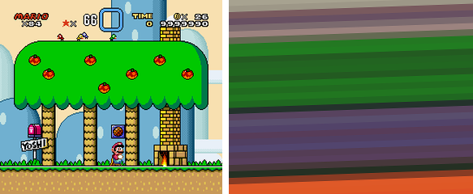
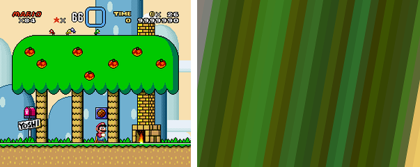

hq_img_convert effects
======================

1. Parameters
-------------

* `-a`, aspect ratio

* `-c`, color

* `-e`, extension

* `-o`, options (#TODO: Change name)

* `-r`, rotation

* `-s`, size

2. Modes
--------

### 1. *frame* - Picture frame

### 2. *hbars* - Horizontal bars

* `-c` controls the overlay color. So, for example, `-c ff0000` would mean the whole image is covered with red while (so
  you'll only see a completely red image) and `-c ff000080` would cover the image with half-transparent red.

* `-o` controls the number of colors and the number of bars. i.e. `-o 4,12` would produce 12 vertical bars of 4 colors. 

* `-r` controls de rotation of the bars. The bars are vertical in the original image, but then they are rotated before
  being applied to the final image.
  
* `-s` is the final size of the image. Aspect ratio won't be preserved so the vertical bars will always cover the entire
  size given.

  
*hbars - original and converted image*

Example:

    hq_img_convert.py hbars -o 12,32 -c 80808040 -r -2 -s 640,480 "test_data/marioworld.png" /tmp/marioworld.png

The process followed by the image is:

   
*#1 Image is drawn with 32 bars of 12 colors*

   
*#2 25% opaque grey (80808040) is overlaid*

  
*#3 Image is rotated -2º and scaled until it completely fills 640x480 pixels*

  
*#4 Image is cropped to final size, 640x480 pixels*

### 3. *magcover* - Magazine cover

### 4. mosaic

### 5. *vbars* - Vertical bars

* `-c` controls the overlay color. So, for example, `-c ff0000` would mean the whole image is covered with red while (so
  you'll only see a completely red image) and `-c ff000080` would cover the image with half-transparent red.

* `-o` controls the number of colors and the number of bars. i.e. `-o 4,12` would produce 12 vertical bars of 4 colors. 

* `-r` controls de rotation of the bars. The bars are vertical in the original image, but then they are rotated before
  being applied to the final image.
  
* `-s` is the final size of the image. Aspect ratio won't be preserved so the vertical bars will always cover the entire
  size given.

  
*vbars - original and converted image*

Example:
    
    hq_img_convert.py vbars -o 6,32 -c ff000080 -r 10 -s 640,480 "src/marioworld.png" "dst/marioworld.png"

The process followed by the image is:

   
*#1 Image is drawn with 32 bars of 6 colors*

   
*#2 Half-transparent red (ff000080) is overlaid*

  
*#3 Image is rotated 10º and scaled until it completely fills 640x480 pixels*

  
*#4 Image is cropped to final size, 640x480 pixels*
